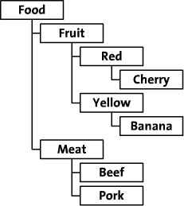
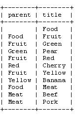
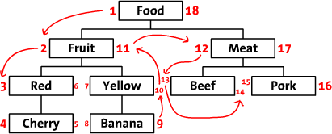
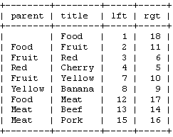
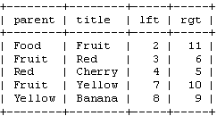

Title: 在数据库中存储层级数据
Author: Gijs Van Tulder
css: http://cdnjs.cloudflare.com/ajax/libs/twitter-bootstrap/2.2.2/css/bootstrap.min.css
HTML header: 

## 在数据库中存储层级数据

By Gijs Van Tulder | April 30, 2003

本文写于 2003 年，且依旧是我们最受欢迎的一篇文章。
如果你非常渴望学习精通数据库管理，你可能会对最近的关于 MySQL 的文章感兴趣。

不管你是想构建自己的论坛、从邮件列表发布消息到你的网页或者想写自己的 CMS ，在某些时刻你会希望在数据库
里存储层级数据。并且，除非你在使用类似 XML 的数据库，表本身不是层级的；它们仅是扁平的列表。
你需要寻找一种方式将层级转换成扁平的文件。

存储树是一个常见问题，存在多种解决方案。主流的主要是两种的方法：邻接表模型和修正的前序树遍历算法。

本文中，我们会探究这两种存储层级数据的方法。我将使用一个虚拟的在线食物商店的树作为示例。
该食物商店通过分类、颜色和类型来组织其食物。该树看起来像这样：

本文包含了一些代码示例来显示如何保存和检索数据。因为我自己使用，很多人也使用或知道它，我选择用 PHP 来写这些示例。
你可以很容易地将它们转换成自己习惯的语言。

### 邻接表模型

我们将尝试的第一种，也是最优雅的，方式称为 **邻接表模型** 或 **递归方法**。
这是一种优雅的方式因为你将只需要单个简单的函数来迭代你的树。
在我们的食物商店里，邻接表模型的表看起来像这样：

可以看到，在邻接表方法中，你会给每个节点保存 `parent` 。可以看到 ‘Pear’ 是 ‘Green’ 的子节点，而它又是 ‘Fruit’
的子节点等等。根节点，‘Food’，不具备 `parent` 值。
简化起见，我使用了 `title` 值作为每个节点的标识。当然，真实的数据库中，你会使用每个节点的数字 ID。

#### 获取树

现在我们在数据库中插入了树，因此是时候写一个显式函数了。该函数会从根节点 -- 没有 `parent` 的节点 -- 开始，并且
会显式所有该节点的子节点。
对这个这样的子节点，该函数也应该检索并显式所有该子节点的所有子节点。更进一步，对每个其相应的子节点，该函数
也会进一步显式所有其子节点，等等。

你可能注意到了，该函数的描述中有一个常规的模式。我们可以仅写一个函数，它将检索某个特定父节点的子节点。
该函数会对每个检索到的子节点启动另一个它本身的实例，以显示所有的它们的子节点。
这种递归机制名为 **递归方法**。

	<?php 
	// $parent is the parent of the children we want to see 
	// $level is increased when we go deeper into the tree, 
	//        used to display a nice indented tree 
	function display_children($parent, $level) { 
	    // retrieve all children of $parent 
	    $result = mysql_query('SELECT title FROM tree '. 
	                           'WHERE parent="'.$parent.'";'); 
	
	    // display each child 
	    while ($row = mysql_fetch_array($result)) { 
	        // indent and display the title of this child 
	        echo str_repeat('  ',$level).$row['title']."\n"; 
	
	        // call this function again to display this 
	        // child's children 
	        display_children($row['title'], $level+1); 
	    } 
	} 
	?>
	
要显式整棵树，我们会传入一个空字符串作为 `$parent` 和 `$level = 0` 即 `display_children('',0);` 
对我们的食物商店树，该函数返回：

	Food
	  Fruit
	    Red
	      Cherry
	    Yellow
	      Banana
	  Meat
	    Beef
	    Pork
	    
注意，如果你只想要一颗子树，你可以让该函数以另一个节点开始。如显式 `Fruit` 子树，
你可以运行 `display_children('Fruit',0);`

#### 到节点的路径

通过几乎相同的函数，你可以查找到某个节点的路径，如果你仅知晓该节点的名称或 ID。
例如，到 `Cherry` 的路径是 `Food > Fruit > Red`。
要获得该路径，我们的函数会从最深的层级开始： `Cherry`。
它然后会查找该节点的父节点，然后将它添加到路径中。
我们的示例中，这就是 `Red`。如果我们知道 `Red` 是 `Cherry` 的父节点，
我们可以通过使用到 `Red` 的路径来计算到 `Cherry` 的路径。
这由我们刚使用的函数给出：通过递归地查找父节点，我们将得到一个树中到任何节点的路径。

	<?php 
	// $node is the name of the node we want the path of 
	function get_path($node) { 
	    // look up the parent of this node 
	    $result = mysql_query('SELECT parent FROM tree '. 
	                           'WHERE title="'.$node.'";'); 
	    $row = mysql_fetch_array($result); 
	
	    // save the path in this array 
	    $path = array(); 
	
	    // only continue if this $node isn't the root node 
	    // (that's the node with no parent) 
	    if ($row['parent']!='') { 
	        // the last part of the path to $node, is the name 
	        // of the parent of $node 
	        $path[] = $row['parent']; 
	
	        // we should add the path to the parent of this node 
	        // to the path 
	        $path = array_merge(get_path($row['parent']), $path); 
	    } 
	
	    // return the path 
	    return $path; 
	} 
	?>
	
该函数现在返回到给定节点的路径。它将路径作为数组返回，因此显式该路径我们可以使用
`print_r(get_path('Cherry'));` 如果你应用到 `Cherry` 上，你将看到：

	Array 
	( 
	    [0] => Food 
	    [1] => Fruit 
	    [2] => Red 
	)
	
#### 缺点

可以看到，这是一种强大的方法。它易于理解，且所需的代码也很简单。
那么，邻接表模型的缺点是什么？在大多数编程语言中，它很慢且低效。
这主要是因为递归的原因。我们需要给树中的每个节点一次数据库查询。

鉴于每次查询都会消耗一定的时间，使得在处理较大的树时该函数会非常慢。

第二个该方法不那么快的原因很可能在于你所使用的编程语言。不像 Lisp，大多数语言不是为了递归函数而设计的。
对每个节点，该函数会启动本身的另一个实例。因此对于具有四个层级的树，你将同时运行该函数的四个实例。
因为每个函数会占用一段内存并消耗一定事件来初始化，当对较大的树应用递归时会非常慢。

### 修正的前序树遍历

现在，让我们看一下另一种存储树的方法。递归可能会很慢，因此我们将不使用递归的函数。
我们也希望最小化数据库查询的次数。最好的情况下，我们希望对每个活动仅需要一次查询。

我们将把我们的树以水平方式排列作为开始。从根节点(`Food`)开始，在它的左边写一个 `1`。
随着树到达 `Fruit`，然后在它旁边写一个 `2`。
通过这种方式，你穿过(遍历)了整颗树的边缘同时在每个节点的左右两侧都写上了一个数字。
最后一个数字写在 `Food` 节点的右侧。在这个图片中，你可以看到整个标数的树，
还有一些箭头表示数字的顺序。

我们称这些数字为 `left` 和 `right` (例如， `Food` 的 `left` 值为 1， `right` 值是 18)。
可以看到这些值表示了每个节点之间的关系。
因为 `Red` 具有数字 3 和 6，它是 1-18 `Food` 节点的后代。
同样的方式，我们可以说所有 `left` 值大于 2 且 `right` 值小于 11 的节点，都是 2-11 `Fruit` 的后代。
现在树结构被存储在 `left` 和 `right` 值中了。
这种遍历树并计数节点的方法称为 **修正的前序树遍历** 算法。

在我们继续之前，让我们看一些我们表中的这些值：

注意，词 `left` 和 `right` 在 SQL 中有特殊含义。因此我们需要使用 `lft` 和 `rgt` 来标识列。
同时注意我们实际上也不再需要 `parent` 列了。我们现在有 `lft` 和 `rgt` 来存储树结构。

#### 检索树

如果你希望显式带有 `left` 和 `right` 值的表中的树，你需要首先标识出你想检索的节点。
例如，如果你想要 `Fruit` 子树，你仅需要选择那些 `left` 值在 2 和 11 间的节点。
SQL 中，它将是：

	SELECT * FROM tree WHERE lft BETWEEN 2 AND 11;
	
它会返回：

这样，一个查询，整颗树搞定！
要像我们在递归函数中那样显式该树，我们需要添加一个 `ORDER BY` 子句到这个查询中。
如果你从表中添加或删除了行，你的表可能就不会有正确的顺序了。
我们因此由它们的 `left` 值排列行。

	SELECT * FROM tree WHERE lft BETWEEN 2 AND 11 ORDER BY lft ASC;
	
还有就是缩进的问题。

为显式树结构，子节点应该比它们的父节点略微缩进深些。我们可以通过持有一个 `right` 值的栈来完成。
每次你开始一个节点的子节点时，你将该节点的 `right` 值加到栈中。
你知道所有该节点的子节点的 `right` 值都比其父节点的 `right` 值小，因此通过比较当前节点的 `right	`
值和栈顶的 `right` 值，你可以知道是否仍在显式属于该父节点的子节点。
当你完成显式一个节点后，你将其 `right` 值从栈顶移除。
如果你计数栈中的元素，你会得到当前节点的层级。

	<?php  
	function display_tree($root) {  
	    // retrieve the left and right value of the $root node  
	    $result = mysql_query('SELECT lft, rgt FROM tree '.  
	                           'WHERE title="'.$root.'";');  
	    $row = mysql_fetch_array($result);  
	
	    // start with an empty $right stack  
	    $right = array();  
	
	    // now, retrieve all descendants of the $root node  
	    $result = mysql_query('SELECT title, lft, rgt FROM tree '.  
	                           'WHERE lft BETWEEN '.$row['lft'].' AND '.  
	                           $row['rgt'].' ORDER BY lft ASC;');  
	
	    // display each row  
	    while ($row = mysql_fetch_array($result)) {  
	        // only check stack if there is one  
	        if (count($right)>0) {  
	            // check if we should remove a node from the stack  
	            while ($right[count($right)-1]<$row['rgt']) {  
	                array_pop($right);  
	            }  
	        }  
	
	        // display indented node title  
	        echo str_repeat('  ',count($right)).$row['title']."\n";  
	
	        // add this node to the stack  
	        $right[] = $row['rgt'];  
	    }  
	}  
	?>
	
运行这段代码，你将得到和上述递归函数得到的相同的树。
我们的新函数很可能更快一些：它不是递归的且仅使用了两次查询。

#### 到某个节点的路径

有了这种算法，我们还需要找到一种新的方式得到到特定节点的路径。
要得到这个路径，我们需要一个所有该节点的祖先的列表。

对我们的新表结构而言，这并没有很多工作量。
当你查看，如 4-5 `Cherry` 节点，你会看到所有其先祖的 `left` 值都小于 4，而 所有 `right` 值都大于 5。
要获得所有祖先，我们可以使用这个查询：

	SELECT title FROM tree WHERE lft < 4 AND rgt > 5 ORDER BY lft ASC;

注意，就像我们先前的查询，我们需要使用 `ORDER BY` 来排列这些节点。
其查询将返回：

	+-------+
	| title |
	+-------+
	| Food  |
	| Fruit |
	| Red   |
	+-------+
	
我们现在仅需要连接这些行来得到 `Cherry` 的路径。

#### 有多少后代

如果给定一个节点的 `left` 和 `right` 值，通过一些简单的数学，我可以告诉你它有多少个后代。

因为每个后代都给该节点的 `right` 值增加了 2，后代的数量可计算为：

	descendants = (right - left - 1) / 2

通过这个简单的公式，我可以告诉你 2-11 `Fruit` 节点有 4 个后代节点，且 8-9 `Banana` 节点是叶节点，而不是父节点。

#### 自动树遍历

现在你可以看到一些对该表的便利的事情，是时候学习我们如何可以自动化该表的创建了。
虽然首次面对这种表和小型的树数据而言这算一次不错的练习，我们确实需要一个脚本来
为我们完成所有这些计数和树遍历。

让我们写一个脚本将一个邻接表转换成一个修正的前序树遍历表。

	<?php   
	function rebuild_tree($parent, $left) {   
	    // the right value of this node is the left value + 1   
	    $right = $left+1;   
	
	    // get all children of this node   
	    $result = mysql_query('SELECT title FROM tree '.   
	                           'WHERE parent="'.$parent.'";');   
	    while ($row = mysql_fetch_array($result)) {   
	        // recursive execution of this function for each   
	        // child of this node   
	        // $right is the current right value, which is   
	        // incremented by the rebuild_tree function   
	        $right = rebuild_tree($row['title'], $right);   
	    }   
	
	    // we've got the left value, and now that we've processed   
	    // the children of this node we also know the right value   
	    mysql_query('UPDATE tree SET lft='.$left.', rgt='.   
	                 $right.' WHERE title="'.$parent.'";');   
	
	    // return the right value of this node + 1   
	    return $right+1;   
	}   
	?>
	
这是一个递归函数。你应该以 `rebuild_tree('Food',1);` 启动它。
该函数然后会检索所有 `Food` 节点的子节点。

如果没有子节点，它会设置其 `left` 和 `right` 值。
其 `left` 值是给定的，1，其 `right` 值为其 `left` 值加 1 。
如果存在子节点，该函数会被重复且最后的 `right` 值会被返回。
该值随后被用作 `Food` 节点的 `right` 值。

递归使得它变得算难以理解复杂函数。然而，这个函数得到了我们在本节开头手动完成的相同的结果。
它遍历整颗树，给它所见到的每个节点添加 1 。
在运行晚该函数后，你会看到 `left` 和 `right` 值还是一样的。(快速检查：根节点的 `right` 值应为所有节点数的两倍)。

#### 添加节点

我们如何给树添加节点？
这里有两种方式：

1. 你可以在你的表中保持 `parent` 列，然后重运行 `rebuild_tree()` 函数 -- 简单但不那么优雅的方式；
2. 你可以更新该新节点右侧的所有节点的 `left` 和 `right` 值

第一个选项非常简单。你使用邻接表方法来做更新，而修正的前序树遍历算法来做遍历。
如果你想添加新的节点，你只需要将它添加到表中并设置其 `parent` 列。
然后你简单的重运行 `rebuild_tree()` 函数。这很简单，但对大型树而言不是很有效率。

第二种方式添加和删除节点是更新该新增节点右侧所有节点的 `left` 和 `right` 值。
让我们看一下例子。我们希望添加一个新类型的水果，一个 `Strawberry`，作为 `Red` 节点的最后一个子节点。
首先，我们需要创建一些空间。`Red` 的 `right` 值需从 6 改为 8， 7-10 `Yellow` 节点需改为 9-12 等等。
更新 `Red` 节点意味着我们需要给所有大于 5 的 `left` 和 `right` 值加 2 。

我们将使用以下查询：

	UPDATE tree SET rgt=rgt+2 WHERE rgt>5;   
	UPDATE tree SET lft=lft+2 WHERE lft>5;

现在我们可以添加一个新节点 `Strawberry` 以填充新的空间。该节点具有 `left` 值 6 和 `right` 值 7 。

	INSERT INTO tree SET lft=6, rgt=7, title='Strawberry';

运行 `display_tree()` 函数，我们可以看到新的节点 `Strawberry` 以及成功插入到树中：

	Food   
	  Fruit   
	    Red   
	      Cherry   
	      Strawberry   
	    Yellow   
	      Banana   
	  Meat   
	    Beef   
	    Pork

#### 缺点

首先，修正的前序树遍历算法看起来难以理解。它显然不如邻接表方法那么简单。
然而，一旦你习惯于 `left` 和 `right` 属性，显然你可以使用该技术完成你可以用邻接表方法所能几乎做到的任何事情，
而且修正的前序树遍历算法更加快速。更新树会花费更多查询，它会更慢一些，但检索这些节点仅需要一个查询。

### 结论

现在你对两种在数据库里存储树的方式都熟悉了。虽然我本人更偏向于修正的前序树遍历，
在你的特定场合中邻接表方法也可能更合适。这些需要你自己去判断。

最后一点：像我已经说过的，我不推荐你使用节点的 `title` 作为节点的指涉。
你需要遵循数据库正规化的基本规则。我这里没有使用数字ID的原因是为了让我的示例更具可读性一些。

### 进阶阅读

More on Trees in SQL by database wizard Joe Celko: 
http://searchdatabase.techtarget.com/tip/1,289483,sid13_gci537290,00.html

Two other ways to handle hierarchical data: 
http://www.evolt.org/article/Four_ways_to_work_with_hierarchical_data/17/4047/index.html

Xindice, the ‘native XML database’: 
http://xml.apache.org/xindice/

An explanation of recursion: 
http://www.strath.ac.uk/IT/Docs/Ccourse/subsection3_9_5.html

If you enjoyed reading this post, you’ll love Learnable; 
the place to learn fresh skills and techniques from the masters. 
Members get instant access to all of SitePoint’s ebooks and interactive online courses, 
like PHP & MySQL Web Development for Beginners.
