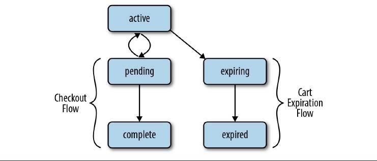

Title: MongoDB 应用设计模式阅读笔记
Author: LiuLongbiao
css: http://netdna.bootstrapcdn.com/twitter-bootstrap/2.3.1/css/bootstrap-combined.min.css
HTML header: 

本文用来记录《MongoDB 应用设计模式》的阅读笔记

## 内嵌还是引用

构建新应用的时候，通常第一件想做的事情就是设计数据模型。
在关系型数据库中，这通常由规范化的过程来形式化，关注于从一系列表中移除冗余。
而 MongoDB 将其数据以结构化文档的形式存储。MongoDB 丰富的文档模型给了你更多的选择空间，
本章就探讨其中一个：你应该在对象中内嵌相关对象还是通过 ID 引用它们。

### 关系型数据库的规范化

* 第一范型：每个行的列值仅能包含一个（仅含一个）值
* 第三范型：
* 规范化以去除冗余
* 取数据需昂贵的 JOIN 操作
* 若去规范化，则更新时需确保同步更新多处

### MongoDB：谁还需要规范化？

MongoDB 中，数据以文档形式存储，可以在列中存储值的数组。

因为 MongoDB 原生支持多值属性，去规范化后可获得性能提升，而不会在更新冗余数据时引入很多困难。
然而这也使得我们的模式设计过程更加复杂。

#### MongoDB 文档格式

MongoDB 建模自 JSON 格式，以 BSON 格式存储。简单地讲 MongoDB 文档即一个键值对字典，
其中值可以是以下几种类型的一种：

* 原生 JSON 类型(如，number, string, Boolean)
* 原生 BSON 类型(如， datetime, ObjectId, UUID, regex)
* 值的数组
* 由键值对组合而成的对象
* null

#### 为本地化而内嵌

一个你想将一对多关系内嵌的原因可能是数据本地化。
MongoDB 将文档在硬盘中顺序存储，因此将所有数据放到一个文档意味着你仅需要一个硬盘
寻址操作来获取所有你需要的东西。

MongoDB 也有一个局限性（因数据库分区简单化的需求所驱动），它没有 JOIN 操作可用。
因此你需要在应用层手动完成，如：

	contact_info = db.contacts.find_one({'_id': 3})
	number_info = list(db.numbers.find({'contact_id': 3})
	
这实际上比关系型的 `JOIN` 操作更糟。
因此如果你的应用总是频繁访问带有所有电话号码的联系人信息的话，
你几乎总是希望将电话号码嵌入联系人信息记录中。

#### 为原子性和隔离性而内嵌

另一个偏好内嵌的权重考量是在写数据时有 **原子性** 和 **隔离性** 的需求。
MongoDB 被设计为不支持多文档事务。

#### 为灵活性而引用

规范化数据模型为多个集合可以给你在执行查询时更多的灵活性。

通常来讲，如果你的恶应用的查询模式已知且数据仅会以一种方式来访问，
内嵌方式工作良好。而如果你的应用会以多种不同的方式查询数据，
或你无法预期数据可能被查询的模式时，更“规范化”的方式会更好一些。

#### 为潜在的高元数关系而引用

另一个偏好使用引用的更规范化模型的权重因子是你的一对多关系可能有非常高
或不可预期的元数。在这种情况下，内嵌会有显著的处罚：

* 文档越大，所用的 RAM 越多
* 增长的文档必须最终被拷贝到更大的空间
* MongoDB 文档具有硬性的尺寸限制 16MB

#### 多对多关系

另一个偏向使用文档引用的因子是多对多或 M:N 关系。

* 模仿关系型数据库模式 -- join 过多
* 完全内嵌 -- 查询简单，但更新时不仅需要更新自身集合，还需要更新所有所嵌入的其他文档
* 折中方案 -- 内嵌一系列 `_id` 而不是整个文档

## 多态模式

MongoDB 有时被认为是一个“无模式”数据库，即它不强制集合中文档具备某个特殊结构。
在一个设计良好的应用中，一个集合会包含相同的或非常相关的结构的文档。
如果集合中所有的文档都类似，但结构不是完全相同的，我们称其为多态模式。

### 多态模式以支持面向对象编程

关系型数据库要支持继承关系建模：

* 创建包含所有可能包含字段的联合，但这会浪费大量空间
* 给每个具体子类创建一个表，但这引入了冗余
* 创建通用表作为基本内容，join 具体的表。

而在 MongoDB 中我们可以在同一个集合中存储所有类型的文档，且仅存储 **相关的** 字段。

关系型数据库中查询时涉及三相 join，而 MongoDB 中的查询则简单得多。

### 多态模式使模式进化成为可能

关系型数据库中模式进化需精心设计的迁移脚本。

MongoDB 中可以一次性更新所有文档：

	db.nodes.update(
		{},
		{$set: { short_description: '' } },
		false, // upsert
		true // multi
		);

但这样在数据量很大时也会影响应用性能。

可选择先在应用层手动处理缺失值

	def get_node_by_url(url):
		node = db.nodes.find_one({'url': url})
		node.setdefault('short_description', '')
		return node
		
然后我们可能选择在后台增量迁移集合，如一次 100 个文档：

	def add_short_descriptions():
		node_ids_to_migrate = db.nodes.find(
		{'short_description': {'$exists':False}}).limit(100)
		db.nodes.update(
		{ '_id': {'$in': node_ids_to_migrate } },
		{ '$set': { 'short_description': '' } },
		multi=True)
		
全部迁移完成后我们就可以忽略默认值了：

	def get_node_by_url(url):
		node = db.nodes.find_one({'url': url})
		return node

#### BSON 存储效率(低效性)

关系型数据库中字段名和类型定义在表级别，而 MongoDB 中字段信息必须被保存在文档中。
特别的，当你存储小型的值，但使用长的属性名时，实际存储量比关系型数据库中会大很多。

Object-Document Mappers

### 多态模式支持半结构化领域数据

一种方式是可以使用通用的子文档属性 `properties` 来包含可变的字段。

	{
		_id: ObjectId(...),
		price: 499.99,
		title: 'Big and Fast Disk Drive',
		gb_capacity: 1000,
		properties: {
		'Seek Time': '5ms',
		'Rotational Speed': '15k RPM',
		'Transfer Rate': '...'
		... }
	}
	
存储半结构化数据的缺点是难以执行查询及在你希望你的应用不知道的字段上建索引。

另一种可能使用的方式是包含属性-值对的一个数组：

	{
		_id: ObjectId(...),
		price: 499.99,
		title: 'Big and Fast Disk Drive',
		gb_capacity: 1000,
		properties: [
		['Seek Time', '5ms' ],
		['Rotational Speed', '15k RPM'],
		['Transfer Rate', '...'],
		... ]
	}
	
用这种方式，我们可以用下面命令让 MongoDB 在 `properties` 字段上建索引：

	db.products.ensure_index('properties')
	
有了索引，我们对指定属性值对的查询如下：

	db.products.find({'properties': [ 'Seek Time': '5ms' ]})
	
### 小结

MongoDB 通过不强制集合中所有文档遵循特定模式的灵活性提供了比 RDBMS 一些好处：

* 更好的面向对象继承和多态
* 模式间更简单的迁移，及更少的应用停机时间
* 更好的支持半结构化领域数据

## 模仿事务行为 [mimicking-transactional-behavior]

关系型数据库常依赖于原子性多语句事务的存在来确保数据的一致性：
或者一组语句所有的都成功，或者都失败，将数据库从一个自一致状态转换到另外一个。
然而当需扩展关系型数据库到多台物理服务器时，事务必须使用两相提交协议，它
显著地减慢了跨多服务器的事务。MongoDB 不允许多文档原子事务，有效地规避了该问题，
但随之而来的是如何在事务 **缺失** 的情况下维护数据库 一致性。

本章将探索 MongoDB 的文档模型及其原子更新操作如何使关系型数据库中需使用事务来维护
数据库一致性的方法。我们还会使用被称为 **偿还法** 的方式来模拟事务行为。

### 获取一致性的关系型方式

原子性多语句事务

跨服务器事务使用两相提交协议

### 复合文档

内嵌关联文档，删除时仅需删除复合文档

### 使用复杂的更新

内嵌文档仅解决了部分 **事务性** 问题。
读取全部文档，在内存中处理，然后整体更新回去的方式引入了竞态条件。
我们可以使用 MongoDB 的原子更新操作在单个步骤中执行相同的操作。
我们还有其他操作可能移除了我们将更新的项目的危险，因此我们会检查我们的更新是否成功，
如果失败，可能是因为有人删除了该项目，我们需试图将它以新的数量 push 进数组中。

	def increase_qty(order_id, sku, price, qty):
		total_update = price * qty
		while True:
			result = db.orders.update(
				{ '_id': order_id, 'items.sku': sku },
				{ '$inc': {
					'total': total_update,
					'items.$.qty': qty } })
			if result['updatedExisting']: break
			result = db.orders.update(
				{ '_id': order_id, 'items.sku': { '$ne': sku } },
				{ '$inc': { 'total': 110.22 },
					'$push': { 'items': { 'sku': sku,
										  'qty': qty,
										  'price': price } } })
			if result['updatedExisting']: break
			
### 用偿还法进行乐观更新

有时在 MongoDB 中不可能用单个 `update()` 来完成你的操作。
普通的两相提交可能会发生竞态条件。

该问题更好的方式是在数据模型中模仿事务。此处，我们将创建一个 `transaction`
集合包含了所有未解决的转换的状态的文档。

* 任何 `new` 状态的事务在超时时将回滚
* 任何 `committed` 状态的事务将总是(最终地)被退休
* 任何 `rollback` 状态的事务将总是(最终地)被撤销

我们的 `transaction` 集合包含文档的格式如下：

	{
		_id: ObjectId(...),
		state: 'new',
		ts: ISODateTime(...),
		amt: 55.22,
		src: 1,
		dst: 2
	}
	
我们的 `account` 模式也稍稍改变以存储待解决的事务 ID 。

	{ _id: 1, balance: 100, txns: [] }
	{ _id: 2, balance: 0, txns: [] }
	
顶层的 `transfer` 函数将一定的量从一个账号转换到另一个，但添加了该事务完成
的最大时间。如果事务花费了更长时间，将由一个周期性过程将其回滚。

	def transfer(amt, source, destination, max_txn_time):
		txn = prepare_transfer(amt, source, destination)
		commit_transfer(txn, max_txn_time)

现在我们有了一个两相提交模型，先准备账号，后提交事务。准备代码如下：

	def prepare_transfer(amt, source, destination):
		# Create a transaction object
		now = datetime.utcnow()
		txnid = ObjectId()
		txn = {
			'_id': txnid,
			'state': 'new',
			'ts': datetime.utcnow(),
			'amt': amt,
			'src': source,
			'dst': destination }
		db.transactions.insert(txn)
		# "Prepare" the accounts
		result = db.accounts.update(
			{ '_id': source, 'balance': { '$gte': amt } },
			{ '$inc': { 'balance': -amt },
				'$push': { 'txns': txn['_id'] } })
		if not result['updatedExisting']:
			db.transaction.remove({'_id': txnid})
			raise InsufficientFundsError(source)
		db.accounts.update(
			{ '_id': dest },
			{ '$inc': { 'balance': amt },
				'$push': { 'txns': txn['_id'] } })
		return txn
		
这里要注意两个关键点：

* 源和目标账号存储了待解决的事务的列表。这让我们可以跟踪某个特定事务ID是否是带决定
* 事务本身必须在特定的时间窗内完成。如果没有的话，一个周期性过程将根据其最终状态
回滚所有未解决事务或提交它们。这处理了应用或数据库在事务中间崩溃的情况。

下面是实际提交转换的函数：

	def commit_transfer(txn, max_txn_time):
		# Mark the transaction as committed
		now = datetime.utcnow()
		cutoff = now - max_txn_time
		result = db.transaction.update(
			{ '_id': txnid, 'state': 'new', 'ts': { '$gt': cutoff } },
			{ '$set': { 'state': 'commit' } })
		if not result['updatedExisting']:
			raise TransactionError(txn['_id'])
		else:
			retire_transaction(txn['_id'])

该函数的主要目的是执行事务状态从 `new` 到 `commit` 的原子更新。
如果更新成功，事务将被退休，即使更新后发生了崩溃。
要实际退休该事务，我们使用以下函数：

	def retire_transaction(txn_id):
		db.accounts.update(
			{ '_id': txn['src'], 'txns._id': txn_id },
			{ '$pull': { 'txns': txn_id } })
		db.accounts.update(
			{ '_id': txn['dst'], 'txns._id': txn['_id'] },
			{ '$pull': { 'txns': txn_id } })
		db.transaction.remove({'_id': txn_id})
		
注意 `retire_transaction` 函数式 **幂等的** ：它可以用相同的 `txn_id` 调用
任意多次，得到的效果和调用一次一样。这意味着如果我们在移除事务对象前
的任意时刻崩溃，随后的清楚进程依旧可以通过简单地调用 `retire_transaction` 退休该事务。

现在我们需要在周期性清除任务中处理超时事务或提交或回滚过程中崩溃的事务。

	def cleanup_transactions(txn, max_txn_time):
		# Find & commit partially-committed transactions
		for txn in db.transaction.find({ 'state': 'commit' }, {'_id': 1}):
			retire_transaction(txn['_id'])
		# Move expired transactions to 'rollback' status:
		cutoff = now - max_txn_time
		db.transaction.update(
			{ '_id': txnid, 'state': 'new', 'ts': { '$lt': cutoff } },
			{ '$set': { 'state': 'rollback' } })
		# Actually rollback transactions
		for txn in db.transaction.find({ 'state': 'rollback' }):
			rollback_transfer()
			
最后，如果我们想回滚一个事务，我们需要更新事务对象并 **撤销** 转换的效果：

	def rollback_transfer(txn):
		db.accounts.update(
			{ '_id': txn['src'], 'txns._id': txn['_id'] },
			{ '$inc': { 'balance': txn['amt'] },
				'$pull': { 'txns': { '_id': txn['_id'] } } })
		db.accounts.update(
			{ '_id': txn['dst'], 'txns._id': txn['_id'] },
			{ '$inc': { 'balance': -txn['amt'] },
				'$pull': { 'txns': { '_id': txn['_id'] } } })
		db.transaction.remove({'_id': txn['_id']})

特别注意，前面的代码仅撤销那些事务依旧存储在账号的 `txns` 数组中的账号的事务。
这使得事务的回滚和通过提交退休一样是幂等的。

## 操作智能

我们要探索的第一个用例属于操作智能领域，即在业务背景下将交易型数据转换成可执行信息的技术。
当然，任何这种技术的起点都是将原始的交易型数据放入你的数据存储中。
我们的第一个用例，[存储日志数据][storing-log-data] 处理了这部分谜题。

有了数据后，首要的事情当然是基于该数据生成报告，更理想的情况下基于数据本身实时产生。
我们在 [预聚合报告][pre-aggregated-reports] 中从事实时产生这些报告。

最后，我们在 [层级聚合][hierarchical-aggregation] 探索更传统的批处理聚合的使用来看看
如何使用 MongoDB 来在多个分析等级的层次生成报告。

### 存储日志数据 [storing-log-data]

传统的日志数据都被存储为纯文本日志文件。尽管纯文本日志是可访问的和人类可读的，它们
却难以使用、引用和分析，而且常被存储在服务器的本地文件系统中那些需要这些数据的业务分析者
通常无法访问的区域。

#### 解决方案概览

此处描述的方案假设了产生事件的每个服务器都能访问 MongoDB 实例并在该实例上对一些
数据库具有读/写访问权限。更进一步，我们假设对日志数据的查询率远低于它的插入率。

#### 模式设计

在 MongoDB 中存储的日志数据的模式依赖于你要存储的时间数据的格式。

当设计文档结构时，关注在 MongoDB 的文档格式 BSON 中已经可用的数据类型很重要。
明智地选择数据类型可以显著地影响日志系统的性能和能力。

#### 操作

本节将描述多种你需要在日志系统上执行的操作，特别注意适当的使用索引和 MongoDB 特有特的性。

##### 插入一条日志记录

时间日志系统的主要性能关注点是：

* 它每秒可支持多少条插入，这限制了时间吞吐量
* 系统如何管理事件数据的增长，特别是在插入活动方面

MongoDB 允许你在执行更新时(如事件数据插入)做的一条决策是你是否希望用数据安全保证
来换取插入速度的增长。

> **写关注**
> 
> MongoDB 具有可配置的写关注。该能力让你可以在保证所有写操作都记录进数据库
> 和插入速度之间做权衡。
>
> 合适的写关注常是一个应用特定的决策，且依赖于你的分析应用的报告需求和使用。

write replica & journal 

##### 批量插入

只要有可能，你应该使用批量插入来插入事件数据。所有的写关注选项都可以应用到批量插入上，
但你可以一次性传递多个事件给 `insert()` 方法。批量插入可以允许 MongoDB 分散更严格的
写关注所带来的性能处罚到一组插入上。

如果你在做批量插入并且最后得到了一个错误（可能是网络中断或唯一键冲突），你的应用将
需要处理部分批量插入的可能性。如果你的应用不关心缺失部分插入，你可以给 `insert` 添加
`continue_on_error=True` ，这样插入会尽可能插入更多的文档，然后报告一个最后一个失败插入错误。

如果你使用了 `continue_on_error=True` 并且你的批量插入失败了，你的应用仅会收到
最后一个失败的信息。因此，有时你可以使用批量插入均摊安全写入的消耗，但这种技术
也带来了另一种写关注集。

##### 查找特定页面上的所有事件

维护一个时间数据的集合的价值来源于能够查询该数据以回答特定的问题。

	>>> q_events = db.events.find({'path': '/apache_pb.gif'})

当然，如果你想该查询运行良好，你需要给它添加一个索引：

	>>> db.events.ensure_index('path')
	
##### 旁白：管理索引大小

在你创建索引时需要记住的是索引所使用的 RAM 的大小。当索引被随机访问时，
整个索引都必须常驻在 RAM 中。

要实际查看某个索引的大小，你可以使用 `collstats`数据库命令：

	>>> db.command('collstats', 'events')['indexSizes']

实际上还有另外一种类型的索引不需要这么多的 RAM，它就是 **右对齐** 索引。
**右对齐** 指的是一个常规索引的访问模式，而不是特定的 MongoDB 的索引类型：
这种情况下，大多数使用该索引的查询关注于索引中的最大(或最小)值，因此大多数索引
实际上从未被使用。面向时间的数据常常有这样的情况，你倾向于查询最新的文档。
这种情况下，在特定时刻仅有索引的冰山一角会常驻在 RAM 中，因此索引大小不太有关系。

##### 查询特定日期的所有事件

我们使用范围查询：

	>>> q_events = db.events.find('time':
	... 	{ '$gte':datetime(2000,10,10),'$lt':datetime(2000,10,11)})

这里，在 `time` 字段上建个索引会优化性能：

	>>> db.events.ensure_index('time')

注意只要我们的查询倾向于查询最新的历史数据，这就是一个右对齐索引。

##### 查找特定主机和日期上所有事件

	>>> q_events = db.events.find({
	... 	'host': '127.0.0.1',
	... 	'time': {'$gte':datetime(2000,10,10),'$lt':datetime(2000,10,11)}
	... })
	
对这种类型的查询而言你可能使用的索引会显著影响其性能。例如，你可以创建一个
`time-host` 字段对上的组合索引，如下：

	>>> db.events.ensure_index([('time', 1), ('host', 1)])
	
要分析上例查询的性能，MongoDB 提供了 `explain()` 方法。我们在控制台
执行 `q_events.explain()` 。它的返回结果类似：

	{ ..
		u'cursor': u'BtreeCursor time_1_host_1',
		u'indexBounds': {u'host': [[u'127.0.0.1', u'127.0.0.1']],
		u'time': [
			[ datetime.datetime(2000, 10, 10, 0, 0),
			datetime.datetime(2000, 10, 11, 0, 0)]]
		},
		...
		u'millis': 4,
		u'n': 11,
		u'nscanned': 1296,
		u'nscannedObjects': 11,
		... }
		
该查询在 4 ms 内从索引中扫描了 1296 项以返回 11 个对象。相反的，
你可以测试以 `host` 字段开头，跟着是 `time` 字段的组合索引。

	>>> db.events.ensure_index([('host', 1), ('time', 1)])
	
现在， `explain()` 告诉我们的如下：

	{ ...
		u'cursor': u'BtreeCursor host_1_time_1',
		u'indexBounds': {u'host': [[u'127.0.0.1', u'127.0.0.1']],
		u'time': [[datetime.datetime(2000, 10, 10, 0, 0),
			datetime.datetime(2000, 10, 11, 0, 0)]]},
		...
		u'millis': 0,
		u'n': 11,
		...
		u'nscanned': 11,
		u'nscannedObjects': 11,
		...
	}

这里，查询在小于1 ms 的时间里在返回 11 个对象前仅需在索引中扫描 11 项。
虽然索引顺序会影响查询性能，还是要记住索引扫描比集合扫描快得多，因此
根据你的查询的情况，使用 `{ time: 1, host: 1 }` 可能意义更清晰些。

##### 索引设计的规则

MongoDB 索引以被称为 B-tree 的数据结构存储。作为 MongoDB 用户你需要知道的是
每个索引会根据索引中所有字段的有序地存储。为了最大化效率，其键应该和使用该索引的
查询完全一样。理想情况下， MongoDB 应该能够遍历索引至查询返回的第一个文档，
然后顺序地 走过索引以找到其他的文档。

鉴于这种有序地 B-tree 结构，以下规则可以通向高效的索引：

* 任何将 **通过相等性** 查询的字段应该出现在索引定义的前面
* 用于排序的字段应随后出现在索引定义中。若多个字段用于排序，则它们应按同样的顺序
出现在索引定义中
* 按范围查询的字段应出现在索引定义的最后

这将导致一些不幸的情况下我们的索引不能最优地使用：

* 当我们在两个或多个属性上具有范围查询时，它们都不能再索引中有效地使用
* 当我们有一个范围查询并且在另一个属性上进行排序时，索引会比在同一个属性上进行范围查询和排序低效

这些情况下，最后的方式是使用典型的数据来进行测试，慷慨的使用 `explain()`。
如果你发现 MongoDB 优化器选择了较差的索引，你可以使用 `hint()` 方法告诉它使用哪个索引。

##### 根据日期和页面汇总请求数

**查找** 请求已经好了，但很多情况下我们需要汇总请求数，或者在分析时对它们进行其他的
聚合操作。

要使用聚合框架，我们需要设置一个操作管道。

`$match` 操作用来限制聚合框架需处理的文档
`$project` 操作符用于限制需仅一步流过管道的数据
`$group` 操作符用于创建新的计算出来的文档

在分片环境中，聚合操作的性能依赖于分片键。理想情况下，特定 `$group` 操作的所有项
都存在于相同的服务器上。

#### 分片考量

最终，你的系统事件将超出单个事件日志数据库实例的容量。这种情况下，你将希望使用一个
**分片集群**，它能利用 MongoDB 的自动分片功能。

##### 限制

分片环境中，最大插入率的限制条件是：

* 集群中分片的数量
* 你所选择的分片键

因为 MongoDB 使用基于 **分片键** 范围的 **块** 来分散数据，分片键的选择可以控制
MongoDB 如何分散数据和结果系统对写入和查询的能力。

理想情况下，你的分片键有两个角色：

* 在分片间平衡插入
* 大多数查询可以 **被路由** 到某个满足的分片的子集

###### 按时间分片
###### 按半随机键分片
###### 按数据集中某个均匀分布的键分片

如果你的文档中具有在文档中均匀地分布的值，那么强烈建议使用这些键作为分片键。

这种方案的一个缺点是所有对特定 `path` 的点击将都进入同一个块，而该块不能被 MongoDB 分解，
因为所有的文档都有相同的分片键。

###### 组合一个自然键和合成键进行分片

MongoDB 支持组合的分片键。

使用这种类型的分片键，数据很大程度上按自然键分布。同时，如果对指定的值没有足够
的分布的话，MongoDB 可使用合成键来在集群间创建分发数据。

大多数情况下，这种键提供了最理想的在集群间分布写入和确保大多数查询仅需要访问
一部分选择的分片之间的平衡。

###### 测试你自己的数据

选择分片键很难，因为没有所谓的“最佳实践”，它的决策对性能的影响很大，而且在作出
选择以后很难或不可能更改分片键。

#### 管理事件数据增长

本节描述了管理事件数据增长的一些策略。

##### 加盖集合

策略：基于你的数据保留需求以及你的报告和分析需要，你可以考虑使用一个 **加盖集合** 来存储事件。
加盖集合具有固定的大小，在达到上限后插入新的数据会自动丢弃旧数据。

> 当前版本中还不能够分片加盖集合

##### TTL 集合

策略：如果你想要可分片的类似于加盖结合东西，你可以考虑在该集合上使用 “存活时间”(TTL) 
索引。如果你在一个集合上定义了一个 TTL 索引，则 MongoDB 会周期性地从集合中 `remove()`
旧的文档。要创建一个 TTL 索引，可使用如下命令：

	>>> db.events.ensureIndex('time', expireAfterSeconds=3600)
	
尽管 TTL 索引很方便，它无法拥有加盖结合的性能优势。因为 TTL `remove()` 没有比
常规的 `remove()` 有优化，它们还是会导致数据碎片（加盖集合不会有碎片）且
在移除时还是需要引发一个索引查找（加盖集合不需要索引查找）

##### 多集合，单数据库

策略：周期性地重命名你的事件集合这样你的数据集合以日志文件轮转相同的方式进行轮转。
需要的时候，你可以从数据库中丢弃最旧的集合。

该方法比单集合方式有几个优势：

* 集合重命名很快且是原子性地
* 丢弃集合时，MongoDB 不需要引入任何文档到内存中
* MongoDB 可以高效地重用通过移除整个集合释放的空间，而不会导致数据碎片

然而，这种操作也会增加查询的复杂性，如果你的某些分析会基于多个集合中的事件数据。
对大多数实时数据采集系统，该方式是理想的。

##### 多数据库

策略：流转数据库而不是集合

虽然这显著地增加了应用插入和查询的复杂度，当你丢弃旧数据库时， MongoDB 会返还
硬盘空间给文件系统。这种方式在你的事件插入率及/或你的数据保留率变化非常大的情况
下会有意义。

### 预聚合报告 [pre-aggregated-reports]

尽管高效地插入事件和日志数据到 MongoDB 并查询这些记录很有用，在将原始数据转换为
可行动信息时更高级别的聚合常常更加有用。本节将探索在 MongoDB 中使用增量更新来
计算和存储预聚合(或预扫描)报告。

#### 解决方案概览

本节列出了将 MongoDB 作为实时收集和处理事件引擎以生成最新到分或最新到秒报告的基本模式和原则。
我们作了如下关于实时分析的假设：

* 你需要最新到分或最新到秒的数据，如果可能的话
* （根据时间）范围数据的查询必须尽可能快
* 需聚合的服务器生成事件能访问 MongoDB 实例

要获得支持这些任务的性能，我们将使用 MongoDB 的 `upsert` 和 `increment` 操作以计算
统计值，允许简单的基于范围查询快速返回数据以支持聚合数据的时序图。

#### 模式设计

实时分析系统的模式必须支持简单快速查询和更新操作。特别的，我们需要避免以下性能杀手：

* 个别文档在其创建后显著增加
* 集合扫描
* 大量（上百）键的文档

##### 每天每页面一个文档，平文档

优点：

* 对网站上每个请求，仅需要更新一个文档
* 对单个页面，一天内某个时间段的报告，仅需获取单个文档

其最大问题是，每次添加数据到 `hourly` 和 `monthly` 字段时，文档会增长。

该问题的解决方案是在文档实际使用前预填充文档为具 0 值的字段。

还有一个问题，当我们到达一天的结尾时，给 MongoDB 执行更新依旧很昂贵。
这是因为 MongoDB 对我们的 `minute` 属性的实际表示是一个它必须顺序地扫描以
找到实际需更新的槽的键值对的数组。其解决方法是给 `minute` 构建层级。

##### 每天每页面一个文档，层级文档

将 `minute` 字段细分为 24 个小时字段。

##### 按粒度水平分离文档

虽然预填充文档可以显著加速我们的更新速度，我们在查询长的跨多天时段如月或季度时还是有问题。
这种情况下，在更高层面存储日聚合数据可以加速这些查询。

这在应用中的数据收集和聚合部分引入了第二个 upsert 操作集，但其在查询时获得的硬盘
查找的减少应该使它值得这部分花费。

#### 操作

##### 记录事件日志

记录事件日志如页面请求是你的系统的主要的“写入”活动。要最大化性能，你将使用
`upsert=True` 来做原地更新，及在它们还没被创建时创建文档。

##### 预填充

为管理文档增长，我们将预填充文档为字段值为 0 的文档。

现在的问题时何时去预填充文档。显然，为了最佳性能，它们需要在使用前进行预填充
（尽管我们的 `upsert` 代码在文档不存在时依旧可以正确工作）。虽然我们可以一次性
预填充所有的文档，但这在预填充时间内会导致较差的性能。更好的方案是在每次我们
记录点击时根据概率进行预填充。

	from random import random
	from datetime import datetime, timedelta, time
	
	# Example probability based on 500k hits per day per page
	prob_preallocate = 1.0 / 500000
	
	def log_hit(db, dt_utc, site, page):
		if random.random() < prob_preallocate:
			preallocate(db, dt_utc + timedelta(days=1), site_page)
		# Update daily stats doc
		...

##### 为实时图表检索数据

##### 为层级图表获取数据

#### 分片考量

### 层级聚合 [hierarchical-aggregation]

尽管 [预聚合报告][pre-aggregated-reports] 技术可以满足很多操作智能系统需求，常常我们
还需要在多个抽象层面计算统计值。本节描述了如何使用 MongoDB 的 `mapreduce` 命令
将交易型数据转换为多个抽象层面上的统计值。

为清晰起见，本例假设了进入的事件数据贮存在名为 `events` 的集合中。
它和 [存储日志数据][storing-log-data] 很适合，使得这两个技术可以很好地一起工作。

#### 解决方案概览

聚合过程的第一步是将事件数据在最细所需粒度上进行聚合。然后我们使用该聚合数据生成
下一级粒度的，并且重复该过程直到生成所有所需的视图。

本方案使用多个集合，层级过程中的所有聚合操作都使用 `mapreduce` 数据库命令。

#### 模式设计

当给事件存储设计模式时，追踪已经包含在聚合中的事件和还没包含的事件很重要。

如果你可以批量插入到 `events` 集合，你可以使用 `find_and_modify` 命令生成 `_id` 值来创建
自增主键，如下：

	>>> obj = db.my_sequence.find_and_modify(
	... query={'_id':0},
	... update={'$inc': {'inc': 50}}
	... upsert=True,
	... new=True)
	>>> batch_of_ids = range(obj['inc']-50, obj['inc'])

然而很多时候，你可以简单地给每个事件包含一个时间戳以区分已处理和未处理事件。

#### MapReduce

MapReduce 算法是一种批量处理大量数据的常见方法。

伪代码：

from collections import defaultdict
def map_reduce(input, output, query, mapf, reducef, finalizef):
	# Map phase
	map_output = []
	for doc in input.find(output):
		map_output += mapf(doc)
		
	# Shuffle phase
	map_output.sort()
	docs_by_key = groupby_keys(map_output)
	
	# Reduce phase
	reduce_output = []
	for key, values in docs_by_key:
		reduce_output.append({
			'_id': key,
			'value': reducef(key, values) })
			
	# Finalize phase
	finalize_output = []
	for doc in reduce_output:
		key, value = doc['_id'], doc['value']
		reduce_output[key] = finalizef(key, value)
		
	output.remove()
	output.insert(finalize_output)

#### 操作

本节假设所有事件都存在于 `events` 集合并有一个时间戳。这些操作将从 `events` 集合聚合
为最小聚合 - 小时汇总 - 然后从小时汇总聚合成更粗粒度层级。
所有操作都将存储聚合时间为 `last_run` 变量。

##### 从 `event` 集合创建小时视图

	mapf_hour = bson.Code('''function() {
		var key = {
			u: this.userid,
			d: new Date(
				this.ts.getFullYear(),
				this.ts.getMonth(),
				this.ts.getDate(),
				this.ts.getHours(),
				0, 0, 0);
		emit(
			key,
			{
				total: this.length,
				count: 1,
				mean: 0,
				ts: null });
	}''')
	
`mapf_hour` 发出包含你所希望聚合的键值对。

	reducef = bson.Code('''function(key, values) {
		var r = { total: 0, count: 0, mean: 0, ts: null };
		values.forEach(function(v) {
			r.total += v.total;
			r.count += v.count;
		});
		return r;
	}''')

reduce 函数返回了和 mapf 函数的输出相同格式的文档。

鉴于 reduce 函数忽略了 `mean` 和 `ts` 值，在 `finalize` 步骤我们将计算这些值：

	finalizef = bson.Code('''function(key, value) {
		if(value.count > 0) {
			value.mean = value.total / value.count;
		}
		value.ts = new Date();
		return value;
	}''')

有了上述代码定义，我们实际的 `mapreduce` 调用如下：

	cutoff = datetime.utcnow() - timedelta(seconds=60)
	query = { 'ts': { '$gt': last_run, '$lt': cutoff } }
	
	db.events.map_reduce(
		map=mapf_hour,
		reduce=reducef,
		finalize=finalizef,
		query=query,
		out={ 'reduce': 'stats.hourly' })
		
	last_run = cutoff

> #### 输出模式
> 
> MongoDB 的 `mapreduce` 针对不同的用例提供了多种输出模式。
>
> * replace - 移除后写入
> * merge - 重写相同键的已有结果值
> * reduce - 将输出集合视作 reduce 阶段的额外输入。常用于增量聚合，根据新数据调整已有结果
> * inline - 输出结果不写入，直接作为 `mapreduce` 命令的返回结果

鉴于我们周期性地根据日期查询 `events` 集合，针对该属性维护一个索引很重要：

	>>> db.events.ensure_index('ts')
	
##### 得到日级数据

要计算日统计，我们可以使用小时统计作为输入。

	mapf_day = bson.Code('''function() {
		var key = {
			u: this._id.u,
			d: new Date(
				this._id.d.getFullYear(),
				this._id.d.getMonth(),
				this._id.d.getDate(),
				0, 0, 0, 0) };
		emit(
			key,
			{
				total: this.value.total,
				count: this.value.count,
				mean: 0,
				ts: null });
	}''')

得到日级数据的 map 函数和初始聚合在以下方面有所不同：

* 聚合键为 `userid-data` 而不是 `userid-hour` 以支持日聚合。
* 发出的键值实际上是小时聚合的 `total` 和 `count` 值，而不是 `event` 文档的属性

所有更高层的聚合操作都是这样。因为该 `map` 函数的输出和前一个 `map` 函数一样，
我们实际上可以重用相同的 `reduce` 和 `finalize` 函数。实际代码如下：

	cutoff = datetime.utcnow() - timedelta(seconds=60)
	query = { 'value.ts': { '$gt': last_run, '$lt': cutoff } }
	
	db.stats.hourly.map_reduce(
		map=mapf_day,
		reduce=reducef,
		finalize=finalizef,
		query=query,
		out={ 'reduce': 'stats.daily' })
		
	last_run = cutoff

这里要注意一些事情。首先，查询不再是基于 `ts` ，而是 `value.ts`。
还要注意，我们实际上是从 `stats.hourly` 集合聚合到 `stats.daily` 集合。

同样，在 `value.ts` 上创建一个索引：

	>>> db.stats.hourly.ensure_index('value.ts')

##### 周和月聚合

我们可以从日统计聚合为周和月统计，所不同的仅在于 `map` 函数的日期计算。

##### 重构 map 函数

#### 分片考量

可能选择 `userid-ts` 作为 `events` 的分片键。
要分片聚合集合，我们必须使用和 `mapreduce` 配合良好的 `_id` 键。
我们还需要添加 `'sharded':True` 到我们的 `h_aggregate` 以支持分片输出。

	def h_aggregate(icollection, ocollection, mapf, cutoff, last_run):
		query = { 'value.ts': { '$gt': last_run, '$lt': cutoff } }
		icollection.map_reduce(
			map=mapf,
			reduce=reducef,
			finalize=finalizef,
			query=query,
			out={ 'reduce': ocollection.name, 'sharded': True })
			
## 电子商务
### 产品目录

为了管理电子商务系统，第一件需要的东西是产品目录。产品目录必须能够存储多种
具有不同的属性集的不同类型的对象。

#### 解决方案概览

#### 操作

对大多数部署而言，产品目录的最主要用法是执行搜索操作。

##### 根据折扣率降序排列查找产品

	query = db.products.find( { 'pricing.pct_savings': {'$gt': 25 })
	query = query.sort([('pricing.pct_savings', -1)])

为支持这种类型的查询，我们将在 `pricing.pct_savings` 字段上创建一个索引：

	db.products.ensure_index('pricing.pct_savings')

> 因为 MongoDB 可以以顺序或降序读取索引，因此创建单元素索引时索引顺序是没有关系的

##### 根据年代查找专辑并按创作年排序

	query = db.products.find({
		'type':'Audio Album',
		'details.genre': 'jazz'})
	query = query.sort([
		('details.issue_date', -1)])

为高效的支持该查询，我们创建一个组合索引：

	db.products.ensure_index([
		('type', 1),
		('details.genre', 1),
		('details.issue_date', -1)])

> 索引的最后部分是排序字段。这可让 MongoDB 有序地遍历索引，并避免缓慢的内存排序

##### 根据主演查找电影

	query = db.products.find({'type': 'Film',
		'details.actor': 'Keanu Reeves'})
	query = query.sort([('details.issue_date', -1)])

索引：

	db.products.ensure_index([
		('type', 1),
		('details.actor', 1),
		('details.issue_date', -1)])

##### 查找标题中带有特定单词的电影

最新版本的 MongoDB 中将具有称为全文索引的特性。如果你准备做很多基于文本的查询时，
最后的方式可能是部署一个分离的全文搜索引擎（如 Apache Solr 或 ElasticSearch）。

尽管在 MongoDB 中没有高效的全文搜索支持，它支持使用正则表达式查询。

	import re
	re_hacker = re.compile(r'.*hacker.*', re.IGNORECASE)
	
	query = db.products.find({'type': 'Film', 'title': re_hacker})
	query = query.sort([('details.issue_date', -1)])

尽管该查询不是特别快，MongoDB 支持有一种类型的正则搜索可以很好地利用索引：前缀正则。
明确地匹配你所搜索的字段的字符串的开头，后跟一些前缀字符，允许 MongoDB 高效的使用"常规"的索引。

	import re
	re_prefix = re.compile(r'^A Few Good.*')
	
	query = db.products.find({'type': 'Film', 'title': re_prefix})
	query = query.sort([('details.issue_date', -1)])

本查询中，我们匹配标题的前缀，MongoDB 可以直接找到我们感兴趣的标题。

> 正则表达式陷阱
>
> 如果你使用 `re.IGNORECASE` 标记，你就又回去了，因为索引创建时是大小写敏感的。
> 如果你想大小写不敏感搜索，通常应该将该字段存储为全小写或全大写格式。

如果你不想使用编译的正则表达式，MongoDB 提供了特定的语法：

	query = db.products.find({
		'type': 'Film',
		'title': {'$regex': '.*hacker.*', '$options':'i'}})
	query = query.sort([('details.issue_date', -1)])

这种类型的查询的索引策略和前面的有所不同。

	>>> db.products.ensure_index([
	... 	('type', 1),
	... 	('details.issue_date', -1),
	... 	('title', 1)])

##### 小结：索引所有东西！

在电子商务系统中，我们通常不能知道用户所要过滤的是什么，因此一个好的想法是
基于很可能出现的查询创建很多索引。尽管这种索引会降低更新速度，产品目录并不常更新，
因此其缺点在搜索速度的显著提升中得到弥补。因此，如果你的应用中有一个代码路径执行
一个查询，那么就应该有一个索引加速该查询。

#### 分片考量

	>>> db.command('shardcollection', 'dbname.product', {
	... key : { 'type': 1, 'details.genre' : 1, 'sku':1 } })
	{ "collectionsharded" : "dbname.product", "ok" : 1 }

##### 不用分片扩展读性能

虽然分片是扩展操作的最佳方式，有些数据集使得难以划分数据以使 `mongos` 能够路由
查询到特定分片。这些情况下，`mongos` 发送查询到所有的分片然后在返回客户端前组合这些结果。

这些情况下，你可以通过在客户端配置读偏好来允许 `mongos` 从复制集的二级
 `mongod` 实例中读取。读取偏好可在每个连接或每个操作上配置。
 
	conn = pymongo.MongoClient(read_preference=pymongo.SECONDARY_PREFERRED)

如果你希望限制读取仅发生在二级上：
	
	conn = pymongo.MongoClient(read_preference=pymongo.SECONDARY)

也可以再特定查询上指定：

	results = db.product.find(..., read_preference=pymongo.SECONDARY_PREFERRED)
	
### 目录层级

产品目录维护者面临的一个问题是产品的分类。产品通常层级地分类以方便目录浏览和产品规划。
浮现的一个问题是当目录改变时如何做。本用例说明了 MongoDB 中如何构建和维护一个层级分类系统。

#### 解决方案概览

为建模一个产品目录层级，我们的方案在每个目录自身的文档中为该特定子目录保存了一系列的先祖目录。

鉴于层级产品目录相对变更不频繁，我们将比更新性能而言更加关心查询性能和更新一致性。

#### 模式设计

简单设计：存储父目录ID

	{ 	_id: "modal-jazz",
		name: "Modal Jazz",
		parent: "bop",
		...
	}

虽然这种模式很灵活，但它仅支持一级层级的查询。如果我们希望查询某分类的所有先祖
或后代，则应该使用其他方式来存储先祖列表。

一种方式是基于父目录的ID来构建子目录的ID：

	{ _id: "ragtime:bop:modal-jazz",
		name: "Modal Jazz",
		parent: "ragtime/bop",
		...
	}

这种方式的方便之处在于：

* 特定目录的先祖从其 `_id` 字段上都是自说明的
* 特定目录的后代可以很容易地通过使用前缀正则表达式查询。如 `{_id: /^ragtime:bop:.*/}`

但它也有一些问题：

* 显示目录的先祖需要第二个查询以返回先祖文档
* 更新层级很繁琐，需要对 `_id` 字段进行字符串操作

我们这里选择的方案是将先祖存储为内嵌数组，每个先祖包含了为了显示的名称。
我们也转换到使用 `ObjectId()` 作为 `_id` 字段并将人类可读的嵌条移到其自己的
`slug` 字段以备根据需要改变。我们最终模式如下：

	{ _id: ObjectId(...),
		slug: "modal-jazz",
		name: "Modal Jazz",
		parent: ObjectId(...),
		ancestors: [
			{ _id: ObjectId(...),
				slug: "bop",
				name: "Bop" },
			{ _id: ObjectId(...),
				slug: "ragtime",
				name: "Ragtime" } ] }

#### 操作

##### 读取和显示一个目录

最常见的基本操作时根据嵌条查询一个目录层级。

	category = db.categories.find(
		{'slug': slug },
		{'_id': 0, 'name': 1, 'ancestors.slug': 1, 'ancestors.name': 1} )

索引：

	>>> db.categories.ensure_index('slug', unique=True)

##### 添加目录到层级中

鉴于我们需要保留所有先祖的信息，因此我们需要实际计算该数组并在执行插入后保存它。
因此我们定义了一下 `build_ancestors` 帮助函数：

	def build_ancestors(_id, parent_id):
		parent = db.categories.find_one(
			{'_id': parent_id},
			{'name': 1, 'slug': 1, 'ancestors':1})
		parent_ancestors = parent.pop('ancestors')
		ancestors = [ parent ] + parent_ancestors
		db.categories.update(
			{'_id': _id},
			{'$set': { 'ancestors': ancestors } })

注意，你仅需向上游历一个层级就能获得构建子目录先祖列表的父目录先祖列表。
插入一个新目录代码如下：

	doc = dict(name='Swing', slug='swing', parent=ragtime_id)
	swing_id = db.categories.insert(doc)
	build_ancestors(swing_id, ragtime_id)

##### 改变一个目录的先祖

首先我们将该目录父目录更新为指定目录：

	db.categories.update(
		{'_id':bop_id}, {'$set': { 'parent': swing_id } } )

然后我们需要更新该目录和其所有后代文档的先祖列表。为此，我们首先在内存中构建该目录的
的一个子图，包含了其所有后代，然后给子图中每个节点计算并存储先祖列表。

	from collections import defaultdict
	def build_subgraph(root):
		nodes = db.categories.find(
			{ 'ancestors._id': root['_id'] },
			{ 'parent': 1, 'name': 1, 'slug': 1, 'ancestors': 1})
		nodes_by_parent = defaultdict(list)
		for n in nodes:
			nodes_py_parent[n['parent']].append(n)
		return nodes_by_parent

当我们有了子图，就可以更新节点了：

	def update_node_and_descendants(
		nodes_by_parent, node, parent):
		
		# Update node's ancestors
		node['ancestors'] = parent.ancestors + [
			{ '_id': parent['_id'],
				'slug': parent['slug'],
				'name': parent['name']} ]
		db.categories.update(
			{'_id': node['_id']},
			{'$set': {
				'ancestors': ancestors,
				'parent': parent['_id'] } })
		# Recursively call children of 'node'
		for child in nodes_by_parent[node['_id']]:
			update_node_and_descendants(
				nodes_by_parent, child, node)

为确保子图构建操作很快，我们需要在 `ancestors._id` 上创建索引：

	>>> db.categories.ensure_index('ancestors._id')

##### 重命名一个目录

首先更新该目录名称：

	db.categories.update(
		{'_id':bop_id}, {'$set': { 'name': 'BeBop' } } )

然后更新在所有后代中的先祖列表：

	db.categories.update(
		{'ancestors._id': bop_id},
		{'$set': { 'ancestors.$.name': 'BeBop' } },
		multi=True)

要知道的一些东西：

* 查询中的 $ 占位符匹配确切匹配的“先祖”实体
* `multi` 选项允许更新所有匹配的文档。默认 MongoDB 仅更新第一个匹配文档

#### 分片考量

鉴于目录集合本身不大，所以分片的价值不大。如果确实需要，鉴于所有查询都涉及 `_id`,
因此它可以是比较合适的分片键：

	>>> db.command('shardcollection', 'dbname.categories', {
	... 'key': {'_id': 1} })
	{ "collectionsharded" : "dbname.categories", "ok" : 1 }

### 库存管理

#### 解决方案概览

#### 模式
`product` 集合为每个用户可放置到购物车的项，称为“库存单元”或 SKU。
在特定 SKU 中包含一个购物车列表页很有用。这样做是因为我们将 `product` 用作
系统的权威性地记录集合。这意味着当 `cart` 和 `product` 包含不一致的数据时，
`product` 集合胜出。因为 MongoDB 不支持多文档事务，因此有一种方式来在两个集合不一致时
“清理”数据，并 `product` 中保持一个 `carted` 属性以提供宽广大道：

	{ _id: '00e8da9b',
		qty: 16,
		carted: [
			{ qty: 1, cart_id: 42,
				timestamp: ISODate("2012-03-09T20:55:36Z"), },
			{ qty: 2, cart_id: 43,
				timestamp: ISODate("2012-03-09T21:55:36Z") }
		]
	}

我们的 `cart` 集合，将包含一个 `_id`, `state`, `last_modified` 以处理过期，及
一个项及数量的列表：

	{ _id: 42,
		last_modified: ISODate("2012-03-09T20:55:36Z"),
		status: 'active',
		items: [
			{ sku: '00e8da9b', qty: 1, details: {...} },
			{ sku: '0ab42f88', qty: 4, details: {...} }
		]
	}

#### 操作

##### 添加一项到购物车中

> 模式
>
> 对该操作和本节其他操作，我们将使用 [第三章][mimicking-transactional-behavior]
> 的模式保持 `product` 和 `cart` 集合的一致性。

基本步骤：

1. 更新购物车，确保它还是活跃的，并添加该产品项
2. **仅在有足够的库存时** 更新库存，降低可用库存量
3. 如果库存因为库存不足而更新失败，通过回滚购物车更新并抛出异常来进行 **偿还**

	def add_item_to_cart(cart_id, sku, qty, details):
		now = datetime.utcnow()
		
		# Make sure the cart is still active and add the line item
		result = db.cart.update(
			{'_id': cart_id, 'status': 'active' },
			{ '$set': { 'last_modified': now },
				'$push': {
					'items': {'sku': sku, 'qty':qty, 'details': details } } })
		if not result['updatedExisting']:
			raise CartInactive()
			
		# Update the inventory
		result = db.product.update(
			{'_id':sku, 'qty': {'$gte': qty}},
			{'$inc': {'qty': -qty},
			'$push': {
				'carted': { 'qty': qty, 'cart_id':cart_id,
					'timestamp': now } } })
		if not result['updatedExisting']:
			# Roll back our cart update
			db.cart.update(
				{'_id': cart_id },
				{ '$pull': { 'items': {'sku': sku } } })
			raise InadequateInventory()

##### 修改购物车中的数量

基本步骤类似于新增：

1. 更新购物车（乐观地假设存在足够库存）
2. 如果存在足够库存，更新 `product` 集合
3. 如果库存不足，回滚购物车更新并抛出异常

	def update_quantity(cart_id, sku, old_qty, new_qty):
		now = datetime.utcnow()
		delta_qty = new_qty - old_qty
		# Make sure the cart is still active and add the line item
		result = db.cart.update(
			{'_id': cart_id, 'status': 'active', 'items.sku': sku },
			{'$set': { 'last_modified': now },
				'$inc': { 'items.$.qty': delta_qty }
			})
		if not result['updatedExisting']:
			raise CartInactive()
		# Update the inventory
		result = db.product.update(
			{'_id':sku,
				'carted.cart_id': cart_id,
				'qty': {'$gte': delta_qty} },
			{'$inc': {'qty': -delta_qty },
				'$set': { 'carted.$.qty': new_qty, 'timestamp': now } })
		if not result['updatedExisting']:
			# Roll back our cart update
			db.cart.update(
				{'_id': cart_id, 'items.sku': sku },
				{'$inc': { 'items.$.qty': -delta_qty } })
			raise InadequateInventory()

##### 付款

检出操作需要完成两个操作：

* 捕获支付明细
* 一旦支付成功，更新 `carted` 项

基本算法：

1. 通过将其设置为 `pending` 状态锁定购物车
2. 收集支付信息。如果失败，解锁该购物车，并将其设回 `active` 状态
3. 将购物车状态设为 `complete`
4. 从 `product` 集合移除任何对该购物车的引用

	def checkout(cart_id):
		now = datetime.utcnow()
		result = db.cart.update(
			{'_id': cart_id, 'status': 'active' },
			update={'$set': { 'status': 'pending','last_modified': now } } )
		if not result['updatedExisting']:
			raise CartInactive()
		try:
			collect_payment(cart)
		except:
			db.cart.update(
				{'_id': cart_id },
				{'$set': { 'status': 'active' } } )
			raise
		db.cart.update(
			{'_id': cart_id },
			{'$set': { 'status': 'complete' } } )
		db.product.update(
			{'carted.cart_id': cart_id},
			{'$pull': {'cart_id': cart_id} },
			multi=True)

为加速更新，给 `carted.cart_id` 添加索引：

	>>> db.product.ensure_index('carted.cart_id')
	
##### 从超时购物车返回到库存中

1. 找到所有老于阈值的购物车并截止。通过将其状态改为 `expiring` 锁定它们。
2. 对每个 `expiring` 购物车，将其所有项返回给可用库存。
3. 一旦 `product` 集合被更新，将购物车状态设置为 `expired`。

	def expire_carts(timeout):
		now = datetime.utcnow()
		threshold = now - timedelta(seconds=timeout)
		# Lock and find all the expiring carts
		db.cart.update(
			{'status': 'active', 'last_modified': { '$lt': threshold } },
			{'$set': { 'status': 'expiring' } },
			multi=True )
		# Actually expire each cart
		for cart in db.cart.find({'status': 'expiring'}):
			# Return all line items to inventory
			for item in cart['items']:
				db.product.update(
					{ '_id': item['sku'],
						'carted.cart_id': cart['id'] },
					{'$inc': { 'qty': item['qty'] },
						'$pull': { 'carted': { 'cart_id': cart['id'] } } }) 
			db.cart.update(
				{'_id': cart['id'] },
				{'$set': { status': 'expired' })

为支持从超时购物车返回，我们需要在 `status` 和 	`last_modify` 属性上创建索引：

	>>> db.cart.ensure_index([('status', 1), ('last_modified', 1)])

##### 错误处理

上述操作都没有处理可能的失败情况。如果我们有了不一致的状态，库存就可能“陷在”了某个购物车中。

为此，我们需要一个周期性清理操作，找到所有具有 carted 项的库存，确保它们存在于某些用户
的活跃的购物车中，如果不是则将它们返回给库存。此处我们访问每个具有老于某个时间戳
的 `carted` 实体的 `product`。然后针对每个找到的 SKU:

1. 加载可能截止的 `cart`。如果它是 `active` 的，则更新 `product` 中的 `carted` 实体。
2. 否则，移除该 `carted` 实体并更新可用库存

	def cleanup_inventory(timeout):
		now = datetime.utcnow()
		threshold = now - timedelta(seconds=timeout)
		# Find all the expiring carted items
		for item in db.product.find(
			{'carted.timestamp': {'$lt': threshold }}):
			# Find all the carted items that matched
			carted = dict(
				(carted_item['cart_id'], carted_item)
				for carted_item in item['carted']
				if carted_item['timestamp'] < threshold)
		# First Pass: Find any carts that are active and refresh the carted
		# items
		for cart in db.cart.find(
			{ '_id': {'$in': carted.keys() },
			'status':'active'}):
			cart = carted[cart['_id']]
			db.product.update(
				{ '_id': item['_id'],
					'carted.cart_id': cart['_id'] },
				{ '$set': {'carted.$.timestamp': now } })
			del carted[cart['_id']]
		# Second Pass: All the carted items left in the dict need to now be
		# returned to inventory
		for cart_id, carted_item in carted.items():
			db.product.update(
				{ '_id': item['_id'],
					'carted.cart_id': cart_id },
				{ '$inc': { 'qty': carted_item['qty'] },
					'$pull': { 'carted': { 'cart_id': cart_id } } })

索引：

	>>> db.product.ensure_index('carted.timestamp')

#### 分片考量

对该系统而已 `_id` 是一个 合理的选择。但是这样有几个缺点：

* 如果购物车集合的 `_id` 是自增的，如 `ObjectId()` ，则所有新增都会归结到单个分片
* 购物车超时和库存调整需要更新操作和查询广播到所有分片

第一个问题可通过使用一个伪随机值作为 `_id`：

	import hashlib
	import bson
	def new_cart():
		object_id = bson.ObjectId()
		cart_id = hashlib.md5(str(object_id)).hexdigest()
		return cart_id

实际分片如下：

	>>> db.command('shardcollection', 'dbname.inventory'
	... 'key': { '_id': 1 } )
	{ "collectionsharded" : "dbname.inventory", "ok" : 1 }
	>>> db.command('shardcollection', 'dbname.cart')
	... 'key': { '_id': 1 } )
	{ "collectionsharded" : "dbname.cart", "ok" : 1 }
	
## 内容管理系统
### 元数据和资源管理
#### 解决方案概览
#### 模式设计

##### GridFS
#### 操作

##### 创建并编辑内容节点

	db.cms.nodes.insert({
		'metadata': {
			'nonce': ObjectId(),
			'parent_id': ObjectId(...),
			'slug': '2012-03-noticed-the-news',
			'type': 'blog-entry',
			'title': 'Noticed in the News',
			'created': datetime.utcnow(),
			'author': { 'id': user_id, 'name': 'Rick' },
			'tags': [ 'news', 'musings' ],
			'detail': {
				'publish_on': datetime.utcnow(),
				'text': 'I noticed the news from Washington today…' }
			}
		})

这里需要解释一下 `nonce` 字段。`nonce` 是一个设计为仅被使用一次的值。
通过使用 `nonce` 字段，我们可以检测编辑冲突并给用户机会解决它。
我们的更新操作如下：

	def update_text(parent_id, slug, nonce, text):
		result = db.cms.nodes.update(
			{ 'metadata.parent_id': parent_id,
				'metadata.slug': slug,
				'metadata.nonce': nonce },
			{ '$set':{'metadata.detail.text': text,
				'metadata.nonce': ObjectId() } },
			safe=True)
		if not result['updatedExisting']:
			raise ConflictError()

我们也可能添加标签到源数据：

	db.cms.nodes.update(
		{ 'metadata.parent_id': parent_id, 'metadata.slug': slug },
		{ '$addToSet': { 'tags': { '$each': [ 'interesting', 'funny' ] } } })

##### 上传照片

##### 定位和渲染节点

##### 按标签搜索节点

##### 生成最近发布博客文章动态

	articles = db.nodes.find({
		'metadata.parent_id': 'my-blog'
		'metadata.published': { '$lt': datetime.utcnow() } })
	articles = articles.sort({'metadata.published': -1})

#### 分片考量

### 存储评论
#### 方法：每个评论一个文档
#### 方法：内嵌所有评论
#### 方法：混合模式设计
#### 分片考量

## 在线广告网络
### 解决方案概览
### 设计1：基本广告投放
#### 模式设计
#### 操作：选择一个广告投放
#### 操作：进行广告竞选活动
#### 分片考量
### 设计2：添加频率上限
#### 模式设计
#### 操作：选择一个广告投放
#### 分片
### 设计3：关键词目标
#### 模式设计
#### 操作：选择一组广告投放

## 社交网络
### 解决方案概览
### 模式设计
#### 独立集合
#### 依赖集合
### 操作
#### 查看新闻动态或涂鸦墙
#### 给文章添加评论
#### 创建新文章
#### 维护社交图
### 分片

## 在线游戏
### 解决方案概览
### 模式设计
#### 角色模式
#### 道具模式
#### 位置模式
### 操作
#### 从 MongoDB 加载角色数据
#### 提取防具和武器数据来显示
#### 提取角色属性、库存和房间信息来显示
#### 从房间中捡起道具
#### 从容器中移除道具
#### 将角色移动到另一个房间
#### 购买道具
### 分片