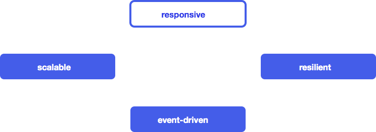
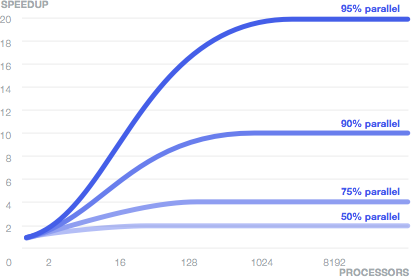
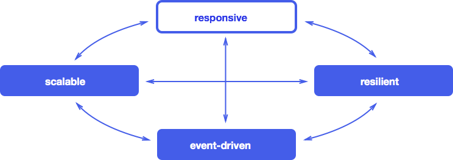

Title: Reactive 宣言 (v1.1)
css: http://netdna.bootstrapcdn.com/twitter-bootstrap/2.3.2/css/bootstrap-combined.min.css
css: http://yandex.st/highlightjs/7.5/styles/rainbow.min.css
HTML header: 
	
	

# Reactive 宣言

## The Need to Go Reactive

近些年应用需求变化非常大。几年前，一个大型应用具有数十个服务器、秒级响应时间、
小时级的离线维护和GB级的数据。现在，应用被部署在从移动设备
到运行在数千个多核处理器的云集群的几乎任何东西上。
用户期望毫秒级甚至微妙级的响应时间和 100% 的在线时间。
数据需求也扩展到了拍字节。

最初由像 Google 或 Twitter 这样的因特网驱动创新型公司的领域，
这些应用角色在大多数行业中开始出现。
金融和电信是最初采纳新的实践以满足新的需求，而后其他行业紧随其后。

新的需求需要新的技术。以前的解决方案着重托管的服务器和容器。
扩展性通过购买更大的服务器和通过多线程并发处理解决。
额外的处理器通过复杂、低效且昂贵的专利型方案来增加。

但现在一种新的架构演化出来，使得开发人员概念化并构建能满足现今需求的应用。
我们称其为 Reactive Application。
这个架构允许开发人员构建事件驱动的、可扩展的、弹性的和响应式的系统：
通过实时感觉递交高度响应式的用户体验，以可扩展的弹性的应用栈作为后盾，
可在多核和云计算架构上部署。
本 Reactive 宣言描述了要变得 Reactive 所需的这些关键特质。

## Reactive Applications

Merriam-Webster 将 reactive 定义为 “随时对刺激做出响应”，即，其组件是活跃的
且总是准备好接收事件。这个定义捕捉了 reactive 应用的要点，关注于如下系统：

* react to events 
事件驱动本质使以下品质可以实现
* react to load 
通过避免在共享的资源上竞争来关注可扩展性
* react to failure 
通过能再任何水平上恢复的能力构建可恢复的系统
* react to users 
负载无关地兑现响应时间保证

它们中的每一个都是 reactive 应用的关键角色。
虽然它们中会有依赖，这些特质不像标准分层的应用架构中的层。
相反，它们描述了跨整个技术栈所应用的设计属性。

下面我们将对每个品质进行详述，并看它们间如何相互关联。

## Event-driven

### 它为何重要

基于异步通信的应用实现了松耦合的设计，这比基于纯同步方法调用更好一些。
发送者和接受者可以以不关心事件如何传播的细节的方式来实现，使得
其接口专注于通信的内容。这使得实现更容易扩展、演进和维护，
给了你更大的灵活性并减少了维护成本。

鉴于异步通信的接收端可保持休眠直到某个事件发生或收到某个消息，
事件驱动方式可高效地使用已有资源，允许大量的接受者可共享单个硬件线程。
一个高负载下的非阻塞应用因此可比传统的基于阻塞同步和通信原语的应用
具备更低的延迟和更高的吞吐量。其结果是更低的操作成本和更高的利用率和更开心的终端用户。

### 关键构建块

在事件驱动应用中，组件间通过事件(具体的描述事实的信息片)的产生和消费来交互。
这些事件以异步和非阻塞的方式来发送和接收。
事件驱动系统倾向于依赖 push 而不是 pull 或 poll，即，它们在数据可用时，
将数据推向消费者而不是通过让消费者持续地请求或者等待数据而浪费资源。

* 事件的异步发送，也称消息传递，意味着应用在设计上就是高并发的，且不需要改变就
能够利用多核硬件。CPU 中的任何一个核都可以处理任何消息事件，导致了并行化的机会
大大提高了。
* 非阻塞意味着持续处理的能力，即对应用而言在任何时候都是可响应的，即使是在
失败或爆发场景下。因此所以对一个响应所需的资源 - 如 CPU、内存和网络 - 都不能是独占的。
因此它能使得低延迟、高吞吐量和更好的可扩展性成为可能。

传统的服务端架构依赖于共享的可变状态及在单个线程上的阻塞操作。
这两点都使得在将这样的系统扩展到满足改变的需求时变得困难。
共享的可变状态需要同步，它引入了偶然复杂度及不确定性，使得代码难以理解和维护。
通过阻塞将线程转为睡眠耗尽了有限的资源且导致了更高的唤醒成本。

将事件的生成和处理解耦，可允许运行时平台来处理同步明细及事件如何在线程间分发，
同时编程抽象被提高到实际业务流程的高度。
你会考虑事件如何在系统中传播以及组件间如何交互而不是在底层的像线程和锁这样的原语上
虚度光阴。

事件驱动系统使得组件和子系统间可以解耦合。这种层级的间接性，如我们将看到的，
是可扩展性和弹性的一个先决条件。通过移除复杂性和组件间的强依赖，
事件驱动应用可以以对已有系统的最小的影响进行扩展。

当应用因对高性能和更大的可扩展性而受压时，很难预言瓶颈将在哪里出现。
因此，整个解决方案是异步和非阻塞的是很重要的。
在典型的例子中，这意味着设计需要从 UI 中的用户请求(浏览器、REST 客户端或其他地方)
到 web 层请求的解析和分发，到中间件中的 Service 组件，一直到缓存直达数据库都需要是
事件驱动的。如果这些层中的某一个没有参与 - 直接在数据库进行阻塞调用、依赖于共享的
可变状态、调用外部昂贵的同步操作 - 则，整个流水线都会停顿，且用户将
要忍受增长的延迟和降低的扩展性。

一个应用必须自上而下都是 reactive 的。

对链中最弱一环的消除需求可由阿姆达尔定律很好地阐述，根据维基百科解释如下：

> 使用多处理器的程序使用并行计算的速度由程序中顺序执行的部分决定。
> 例如 95% 的程序可并行化，则使用并行计算理论最大速率将是如图所示的 20X ，
> 不管使用了多少个处理器。

## Scalable

### 它为何重要

Scalable 被 Merriam-Webster 定义为 “可以根据需要很容易扩展和升级的能力”。
一个可扩展应用能够根据其使用情况被扩展。
这可以通过给应用添加弹性来获得，根据需要能够横向扩展(添加或移除节点)的选项。
另外，这个架构使得它很容易纵向扩展(在具有更多或更少 CPU 的节点上部署)而不用
重新设计或重写应用。弹性使得能够最小化在云计算环境上操作系统的成本，
让你可以从其按使用付费模型中受益。

可扩展性也能缓和管理风险：提供过少的硬件来追赶用户负载导致客户的不满和流失，
而拥有过多硬件 - 及操作人员 - 毫无理由的空闲导致不必要的花费。
一个可扩展的方案也能缓解应用在新的硬件可用时却无法充分利用的风险：
我们将看到在下一个十年具有数百个处理器，如果不是数千个硬件线程，且
利用这些潜在的需要应用在更细粒度上具有可扩展性。

### 关键构建块

一个基于异步消息传递的事件驱动系统给可扩展性提供了基础。
组件和子系统间的解耦合和位置独立性让在多个节点上扩展系统同时
维持相同的编程模型上具有相同的语义成为可能。
给组件添加更多的实例提高了系统处理事件的能力。
以实现的角度看，以利用多核进行竖直扩展还是通过利用在数据中心或集群中
的更多的节点进行水平扩展是没有区别的。
应用的拓扑成为了一个通过配置表示以及/或根据应用实际的适应性运行时算法的
一个部署决策。这一点我们称为位置透明。

重要的是理解其目标不是试图实现透明的分布式计算、分布式对象或 RPC 风格的计算，
这些已经被尝试过并已经失败了。
相反我们需要通过直接在编程模型中通过异步消息传递拥抱网络。
真的可扩展性自然地涉及分布式计算且其节点间通信，即穿过网络，如我们所知
是内在不可靠的。因此要在网络编程中的显化这些约束、权衡和失败场景，
而不是将它们隐藏在有漏洞的试图“简化”事物的抽象后面。
因此，提供封装了常见的为解决在分布式环境中出现的典型问题的构建块的编程工具
也同样重要 - 如为取得一致性的机制或提供更高可靠性的消息抽象。

## Resilient

### 它为何重要

应用停机时间是可能发生在业务上伤害性最大的问题。
常见的隐含是操作会简单的停止，在收入流中留下了一个洞。
在长期上，这也会导致不开心的客户和更不好的声誉，它会更严重地伤害业务。
很奇怪的是应用可恢复性常是最被忽略的一个需求或使用即席技术改型过。
这常意味着它常常使用过于粗粒度的工具在错误的粒度水平处理。
一个的常见技术使用应用服务器集群来从运行时和服务器故障中恢复。
不幸的是，服务器故障恢复是非常高代价的也是危险的 - 潜在地会导致
级联故障使得整个集群都当掉。
其原因是对故障管理上采用了错误的粒度，相反本应在组件水平的更细的粒度上
使用细粒度可恢复性来处理。

Merriam-Webster 将 resilience 定义为：

* 一个物质或对象恢复到其形状的能力
* 从困境中快速恢复的能力

在 reactive 应用中，可恢复性不是马后炮，而是从一开始的设计的一部分。
让故障成为编程模型中的第一类的构造提供了对其作出反应和管理的机制，
这导致应用通过能够在运行时自修复和恢复对故障有更大的宽容度。
传统的错误处理无法做到这点因为它在局部是防御式的
而在更大的规模上又过于有侵略性 - 你或者在它们所发生的时间地点处理异常
或者初始化整个应用实例的故障恢复。

### 关键构建块

为了管理故障我们需要一个方式来隔离它，这样它不会蔓延到其他健康的组件，
以及观察它，这样它可以在失败上下文之外的某个安全点进行管理。
一个可想到的模式的舱壁模式，由图片演示，这个模式中系统由安全舱构建而成，
因此其中的某一个故障时其他舱不会受到影响。
这避免了经典的级联故障的问题并且允许隔离地管理问题。

事件驱动模型，不仅使可扩展性成为可能，也具有所需的原语来实现这种故障管理的模型。
事件驱动模型中的松耦合提供了完全隔离的组件，其中故障可连同其上下文一起被捕获，
封装为消息，并发送给其他可检察该错误并决定如何响应的组件。

这种方式创建了一个系统其业务逻辑保持清晰，与非期望的处理分隔开，
其故障被明确地建模以声明式的方式被区分、观察、管理和配置，
且系统可以自愈并自动恢复。
它在隔间以层级风格组织时工作得最好，很像一个大的企业，其中
一个问题被逐步上升直到达到一个有能力处理它的水平。

这个模型的美在于它是纯事件驱动的，基于 reactive 组件和异步事件以及
因此而来的位置透明性。实际中这意味着它在分布式环境中和在本地上下文中
具有相同的语义。

## Responsive

### 它为何重要

Responsive 被 Merriam-Webster 定义为“快速响应或适当地反应”。
我们以其常规意义使用该单词，且不应该和响应式 Web 设计相混淆，其主要
涉及 CSS 媒体查询和渐进增强。

响应式应用是实时、迷人、丰富和协作的。业务通过响应式交互体验来欢迎客户
来创建了一个开放和带着其客户的前进的对话框。
这使得他们更加高效，创建一种被链接和整装解决问题和完成任务的感觉。
一个例子是 Google Docs ，它让用户可以实时协作的编辑文档， - 允许他们看见
其他人所做的编辑和动态地注解。

响应事件的应用需要以及时的方式来完成，即使是在故障存在的时候。
若应用不能在合适的时间约束中做出响应 - 也成为延迟 - 则它实际上是不可用的，
因此也不能被考虑为可恢复的。

在满足硬实时系统约束的无能对某些应用如武器或医学控制系统而言相当于整个系统故障。
不是所有的应用都有如此严格的需求。
很多应用因其偏离响应约束可见到快速降低的利用率，例如金融交易应用
在没有及时响应时会遗失当前交易。

更多主流应用，如零售浏览和采购，显示了在响应时间增加时可测的利用率的下降。
用户和更加响应式的应用交互，可导致更大的采购量。

### 关键构建块

Reactive 应用使用 observable 模型、事件流和有状态客户端。

Observable 模型让其他系统可在状态改变时收到事件。
这可提供用户和系统间的实时的连接。
例如当多个用户在同一个模型上并发地工作时，变更可以在它们间反应式地
双向地同步，这样感觉上模型在没有锁约束地进行共享。

事件流构成了该连接所构建的基本抽象。
保持它们 reactive 意味着避免阻塞且相反要允许异步和非阻塞地转换和通信。

Reactive 应用通过使用设计模式和测试来确保响应时间不管负载如何都能
在 O(1) 或至少 O(log n) 的时间内返还来拥抱算法的阶。
扩展因子可包含但不限于客户、回话、产品和交易。

它们采用了大量策略来保持负载状况无关地响应延迟的一致性：

* 在突发通信量条件下，reactive 应用通过应用批量化连同对底层资源的理解
和考量来保持延迟一致性来摊销昂贵的操作的成本，如 IO 和并发数据交换等。
* 队列由应用合适的背压来限界，对给定响应约束的队列长度由采用 Little's Law
来决定。
* 系统被监控仪在适当位置具有合适的容量规划
* 故障在 circuit breakers 被触发时由随时可用的替代的处理策略来隔离

作为一个响应式应用的示例，考虑一个具有富客户端 - 基于浏览器或者移用应用
- 的 web 应用，来创建迷人的用户体验。
这个应用将执行逻辑并在客户端存储状态，其中 Observable 模型提供了一个
在数据变更时实时更新 UI 的机制。
如 WebSockets 或 服务端发送事件使得 UI 可通过推送事件流直接连接
这样事件驱动系统可扩展所有的后端方式到客户端。
这允许 reactive 应用通过使用异步和非阻塞数据转换
以可扩展和可恢复的方式推送事件到浏览器和移动应用。

有了这些想法，这四个品质：事件驱动、可扩展性、可恢复性和响应式如何
相互连接来形成整个应用变得很清晰。

## 小结

响应式应用表示了处理大量在软件开发中的当代挑战的均衡的方式。
构建在事件驱动、基于消息的基础上，它们提供了用于确保可扩展性和可恢复性
所需的工具。在这个基础上，它们提供了丰富的响应式的用户交互。
我们期望从今以后快速增加数量的系统能够遵循本蓝图。